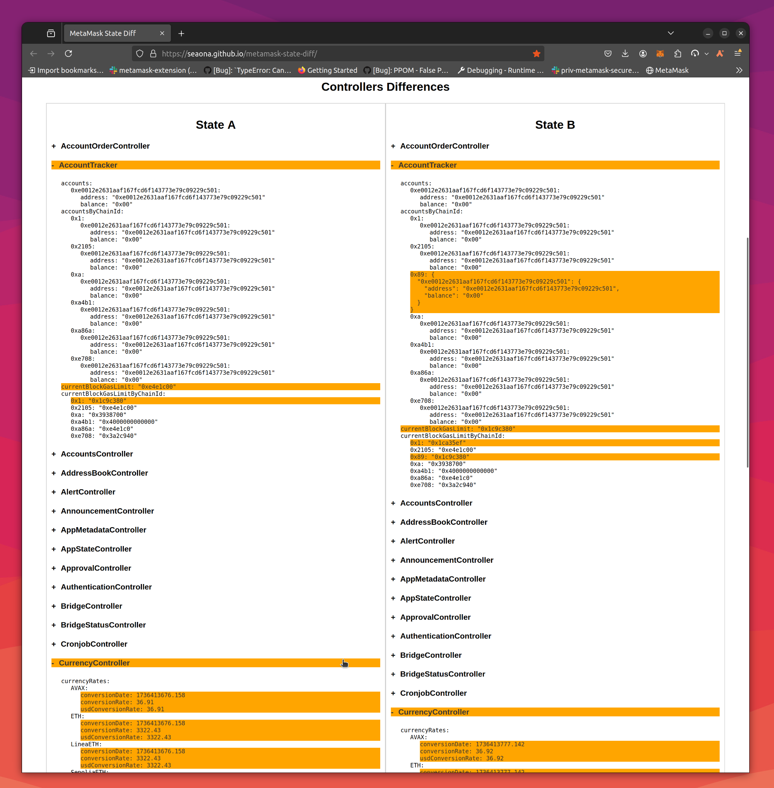

# MetaMask State Diff

## Description
This project is a JSON diff viewer specifically designed for debugging MetaMask states. It allows users to compare two JSON objects representing different states of MetaMask side by side. The tool highlights the differences between the two inputs, making it easier to identify changes and debug issues effectively. The application features a user-friendly interface with collapsible sections for each controller, providing a clear view of the data.

### Screenshots

## Features
- Compare two JSON inputs representing MetaMask states and view differences.
- Collapsible sections for each controller.
- User-friendly interface with tooltips and clear buttons.

## Usage
1. Extract the MetaMask state by running the command `await stateHooks.getPersistedState()` in the console.
2. Enter the 2 JSON objects in the provided text areas.
2. Click the "Show Differences" button to view the differences highlighted.
3. Use the collapsible sections to explore the data in detail.
